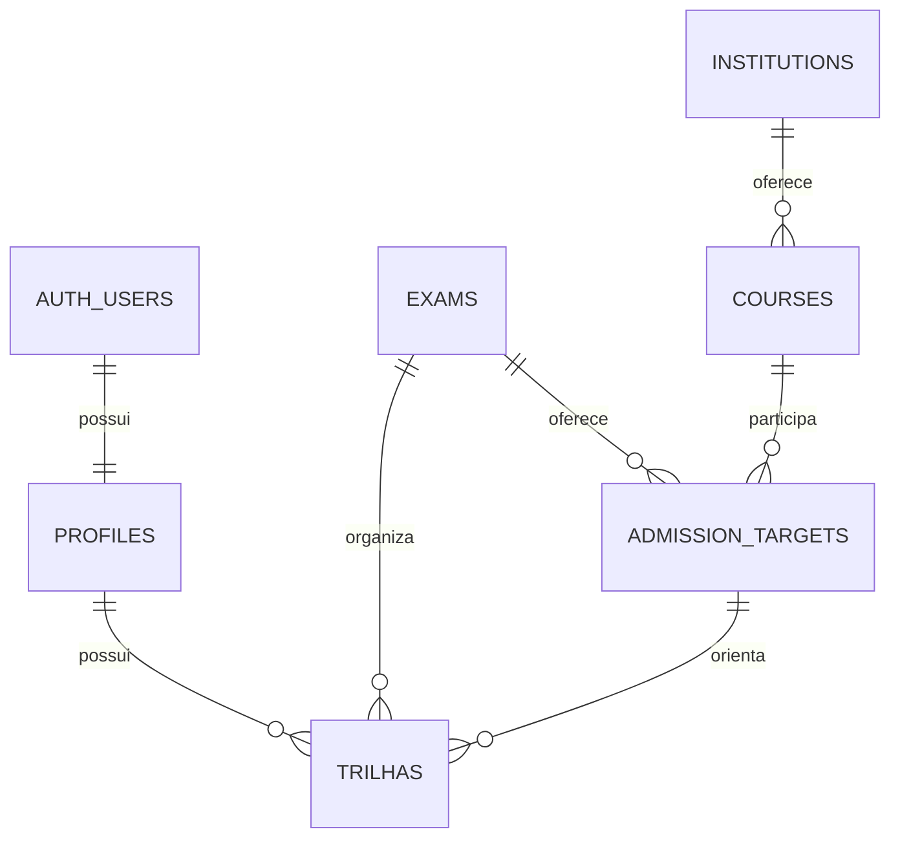

# Esquema da Fase 2

Migration: `supabase/migrations/202609070001_foundation.sql`.

| Tabela              | Chave                         | Campos e referências principais                                               |
| ------------------- | ----------------------------- | ----------------------------------------------------------------------------- |
| `auth.users`        | UUID gerenciado pelo Supabase | Identidade, e-mail e credenciais gerenciados pelo serviço Auth                |
| `profiles`          | `id → auth.users.id`          | Nome de exibição, trilha ativa, data de onboarding e timestamps               |
| `exams`             | `id` textual                  | Nome, ativo e marcador de desenvolvimento                                     |
| `institutions`      | `id` textual                  | Nome, sigla e marcador de desenvolvimento                                     |
| `courses`           | `id` textual                  | Instituição, nome do curso, campus e modalidade                               |
| `admission_targets` | UUID                          | Vestibular, curso, edição, concorrência, fase, fonte e nota de corte opcional |
| `trilhas`           | UUID                          | Proprietário, vestibular, objetivo e timestamps                               |

`profiles.active_trilha_id` aponta opcionalmente para uma das trilhas da própria conta. Apenas a função autorizada de troca pode gravar essa seleção. Usuários podem editar diretamente somente `display_name`, sob RLS.

## Restrições

- `unique(user_id, exam_id)` impede duplicar a mesma trilha em uma conta.
- A FK composta `(target_id, exam_id)` impede vincular objetivo de UNICAMP a uma trilha FUVEST.
- Curso pertence a uma instituição. Campus e modalidade distinguem ofertas de curso.
- Um objetivo identifica vestibular, curso, edição, modalidade de concorrência e fase. Vários usuários podem escolher o mesmo objetivo.
- Nota de corte fica nula enquanto não houver fonte HTTPS, escala e data de verificação. A base de desenvolvimento não contém notas de corte.
- Excluir um usuário em Auth remove seu perfil e suas trilhas. Excluir uma trilha limpa sua referência ativa; a função de remoção escolhe outra trilha própria, quando houver.
- Objetivos desativados permanecem visíveis aos usuários que já os escolheram, mas não podem ser escolhidos de novo.

## Operações transacionais

`confirm_trilhas(target_ids)` valida uma seleção de até oito vestibulares, salva as trilhas e conclui onboarding em uma única transação. Repetir a seleção não duplica trilhas nem substitui objetivos existentes. Alteração de objetivo usa função própria.

`switch_trilha(trilha_id)`, `change_trilha_target(trilha_id, new_target_id)` e `remove_trilha(trilha_id)` verificam o proprietário por `auth.uid()`. O cliente nunca informa o ID do proprietário.

As mutações bloqueiam a linha do perfil para serializar ações concorrentes da mesma conta. São funções `security definer` com `search_path` vazio, nomes qualificados e execução concedida apenas ao papel autenticado. Acesso direto a INSERT/UPDATE/DELETE de trilhas é negado.

## Escopo dos testes

Os testes executam a migration e o seed em PGlite, uma compilação embarcada do PostgreSQL. Testam RLS usando papéis autenticados distintos, restrições, transações e dados após reinicialização do banco. A função de identidade de Supabase é emulada no teste; login e e-mail reais precisam do serviço conectado.
